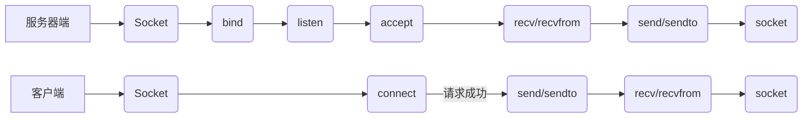
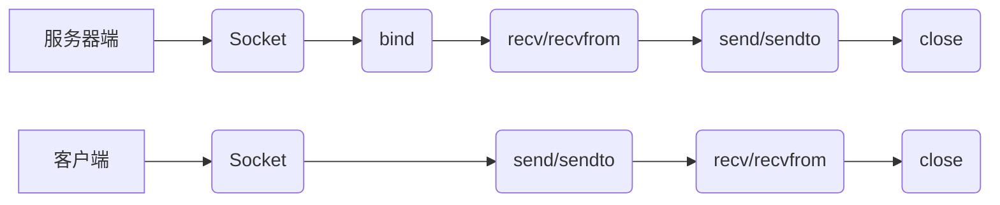

@[toc]
### 套接字
> **套接字是操作系统内核中的一个数据结构**，它是网络中的节点进行相互通信的门户，是网路进程的ID。网络通信归根结底是不同计算机上的进程通信。每个节点都有专属的IP地址。要进行网络通信首先要确定**IP地址**，但是网络地址只能确保是在哪台计算机上，没有办法确定是哪个进程，这时就需要**端口号**。端口号和进程是一一对应的。所以以网络地址和端口号组成的数据段就成了**套接字**。

#### Socket的概念

> Linux的网络编程是通过Socket来进行的。Socket是一种特殊的I/O接口，也是一种文件描述符。
> 每一个Socket都用一个半相关描述“{协议、本地地址、本地端口}”来表示。
> 一个完整的套接字则用相关描述“{协议、本地地址、本地端口、远程地址、远程端口}”来表示。

#### Socket的类型

- 流式Socket（SOCK_STREAM）
    - 用于TCP通信。
    - 提供可靠的、面向连接的信息流。
- 数据报Socket（SOCK_DGRAM）
- - 用于UDP通信
- - 无连接服务，数据通过相互独立的报文进行传输，是无序的，并且不保证是可靠、无差错的。
- - 使用数据报协议UDP
- 原始Socket（SOCK_RAW）
- - 用于新的网络协议实现的测试等。
- - 原始套接字允许对底层协议如IP或ICMP进行直接访问，他功能强大但使用较为不便，一般用于协议的开发。

### Socket的信息数据结构

```C
struct in_addr
{
	unsigned long int s_addr; /*32位的IPv4地址，网络字节序*/
};
struct sockaddr
{
	unsigned short sa_family;/*地址族  AF_INET : IPv4   AF_INET6 : IPv6*/
	char sa_data[14];		 /*14字节的协议地址，包含该Socket的IP地址和端口*/
};

struct sockaddr_in
{
	short int sa_family;		 /*地址族*/
	unsigned short int sin_port; /*端口号*/
	struct in_addr sin_addr;	 /*IP地址*/
	unsigned char sin_zero[8];	 /*填充0以保持与struct sockaddr同样大小*/
};

```

### 数据存储优先顺序的转换

> 计算机数据存储有两种字节优先顺序
> 对于内存中存放的数0x12345678
> - 大端模式：高位字节优先 0x12345678
> - 小端模式：地位字节优先 0x78563412

> 如果称某个系统所采用的字节序为主机字节序，则它可能是小端模式，也可能是大端模式。而端口号和IP地址是网络字节序而不是主机字节序存储的。所以需要对两个字节存储优先顺序进行转换。

```C
//将32位主机字节序转换成网络字节序
unsigned long int htonl(unsigned long int hostlong);
```

```C
//将16位主机字节序转换成网络字节序
unsigned short int htonl(unsigned short int hostlong);
```

### 地址格式转换
> 用户表达地址时采用点分十进制。
> Socket编程时使用32位的网络字节序的二进制
> IPV4：inet_aton()；inet_addr()；inet_ntoa()；
> IPV4 && IPV6 同时兼容：inet_pton()；inet_ntop()；

```C
void add_trans(void)

{

       char ip[] = "192.168.0.101";

       struct in_addr myaddr;

       /*inet_aton*/

       int iRet = inet_aton(ip, &myaddr);

       printf("%x\n", myaddr.s_addr);

       /*inet_addr*/

       printf("%x\n", inet_addr(ip));

       /*inet_pton*/

       iRet = inet_pton(AF_INET, ip, &myaddr);

       printf("%x\n", myaddr.s_addr);

       myaddr.s_addr = 0xac100ac4;

       /*inet_ntoa*/

       printf("%s\n", inet_ntoa(myaddr));

       /*inet_ntop*/

       inet_ntop(AF_INET, &myaddr, ip, 16);

       puts(ip);

       return 0;

}


#ifdef _SOCKET_

int main()

{

       add_trans();

}

#endif // _SOCKET_


```

结果：
![\[外链图片转存失败,源站可能有防盗链机制,建议将图片保存下来直接上传(img-gn9wQIEA-1683166544408)(en-resource://database/748:1)\]](https://i-blog.csdnimg.cn/blog_migrate/6daa89353c2f2494c42b07c289fa6985.png)


### 名字地址转换

> 主机名与域名的区别：
> - 主机名：通常在局域网内使用
> - 域名：通常在Internet使用

> DNS解析：将域名转换为对应的IP地址。

```C
//将IP地址转化为主机名/域名
int gethostbyaddr_r(const void *addr, socklen_t len, int type,struct hostent *ret, char *buf, size_t buflen,struct hostent **result, int *h_errnop);
//将主机名/域名转化为IP地址
int gethostbyname_r(const char *name,struct hostent *ret, char *buf, size_t buflen, struct hostent **result, int *h_errnop);
```
***
```C
void dns_trans(int argc, char** argv)
{
	char* ptr, ** pptr;
	struct hostent* hptr;
	char str[32] = { '\0' };
	/*保存要解析的域名*/
	ptr = argv[1];
	hptr = gethostbyname(ptr);
	if (NULL == hptr)
	{
		printf("gethostbyname error : %s\n", ptr);
		return;
	}
	/*打印主机的规范名*/
	printf("offical hostname:%s\n", hptr->h_name);
	/*将主机的所有别名打印*/
	for (pptr = hptr->h_aliases; *pptr != NULL; pptr++)
	{
		printf("aliases:%s\n", *pptr);
	}
	/*根据地址类型，打印地址*/
	switch (hptr->h_addrtype)
	{
	case AF_INET:
	case AF_INET6:
		pptr = hptr->h_addr_list;
		for (; *pptr != NULL; pptr++)
		{
			printf("address:%s\n", inet_ntop(hptr->h_addrtype, *pptr, str, sizeof(str)));

		}
		break;
	default:
			break;
	}
}
```


结果：
- www.baidu.com
![\[外链图片转存失败,源站可能有防盗链机制,建议将图片保存下来直接上传(img-en4uAix1-1683166544409)(en-resource://database/753:1)\]](https://i-blog.csdnimg.cn/blog_migrate/9971766dc7222057d4bca9ee8a484a38.png)

- www.aliyun.com
![\[外链图片转存失败,源站可能有防盗链机制,建议将图片保存下来直接上传(img-8pGr40zV-1683166544410)(en-resource://database/759:1)\]](https://i-blog.csdnimg.cn/blog_migrate/70b7b47ed57595042153207b671e9daf.png)


### 网络编程

- TCP流程图



- UDP流程图



#### TCP通信流程解析

- Socket() : 建立一个新的Socket。
- bind() ： 用于对Socket进行定位。
-  listen() ： 一般在Socket创建和bind后使用，用于等待连接。
-  accept() ：用于接受Socket的连接。其中的参数s的Socket必须经过bind()和listen()处理过。有连线进来时会返回一个新的Socket处理代码。可以理解为拨打10086时，经过机器人的询问后会给你发配给一个话务员解决客户问题。客户请求服务器连接，服务器在bind()和listen()操作后，分配给一个新的Socket。用这个Socket进行通信。
-  send()/sendto()：发送数据
-  recv()/recvfrom()：接收数据

### 采用TCP的C/S架构实现

#### 模块封装(tcp_net_socket.h)

```C
#ifndef __TCP_NET_SOCKET_H__
#define __TCP_NET_SOCKET_H__

#include <stdio.h>
#include <stdlib.h>
#include <string.h>
#include <sys/types.h>
#include <sys/socket.h>
#include <netinet/in.h>
#include <arpa/inet.h>
#include <unistd.h>
#include <signal.h>

#define COMMON_ERROR  -1

#define PERROR(err, ret) \
    do { \
	    perror(err); \
        if (ret) { \
            exit(EXIT_FAILURE); \
        } \
    } while (0)


#define PERROR_C(err, ret, sfd) \
    do { \
        perror(err); \
        if (ret) { \
            close(sfd); \
            exit(EXIT_FAILURE); \
        } \
    } while (0)

#define PERROR_CC(err, ret, sfd, cfd) \
    do { \
        perror(err); \
        if (ret) { \
            close(sfd); \
            close(cfd); \
            exit(EXIT_FAILURE); \
        } \
    } while (0)

/*初始化操作：Socket创建，bind定位，listen建立*/
extern int tcp_init(const char* ip, int port);

/*用于服务端的接受，接受请求成功返回新的Socket new_fd*/
extern int tcp_accept(int sfd);

/*用于客户端的连接*/
extern int tcp_connect(const char* ip, int port);

#endif //__TCP_NET_SOCKET_H__
```

#### 服务端实现（tcp_net_server.c）

```C
#include "tcp_net_socket.h"

void server_start(int argc, char* argv[])
{
	int sfd;
	int ret = 0;

	if (argc < 3)
	{
		printf("param error");
	}

	//tcp初始化

	sfd = tcp_init(argv[1], atoi(argv[2]));

	while (1)
	{
		//接受连接

		int cfd = tcp_accept(sfd);
		char buf[512] = { 0 };
		char msg[32] = { "Hello I am server." };
		//接受客户端传来的数据并存入buf中。

		ret = recv(cfd, buf, sizeof(buf), 0);
		PERROR_CC("recv", (COMMON_ERROR == ret), sfd, cfd);
		puts(buf);
		//从buf中取出，并向cfd客户端发送数据

		ret = send(cfd, msg, strlen(msg), 0);
		PERROR_CC("send", (COMMON_ERROR == ret), sfd, cfd);
		close(cfd);
	}
	close(sfd);
}

int main(int argc, char* argv[])
{
	server_start(argc, argv);
	return 0;
}
```

#### 客户端(tcp_net_client.c)

```C
#include "tcp_net_socket.h"

void client_start(int argc, char* argv[])
{
	int sfd;
	int ret = 0;
	char buf[512] = { 0 };
	char msg[32] = { "Hello I am client." };

	if (argc < 3)
	{
		printf("param error");
	}
	//发送连接请求

	sfd = tcp_connect(argv[1], atoi(argv[2]));

	send(sfd, msg, strlen(msg), 0);
	recv(sfd, buf, sizeof(buf), 0);
	puts(buf);
	close(sfd);
}

int main(int argc, char* argv[])
{
	client_start(argc, argv);
	return 0;
}
```

结果：

服务端：


***
客户端：


### 并发服务器实现

> 上述代码可以实现多个客户端访问服务器，但是是阻塞的，即在一个客户访问时会阻塞其他客户。

#### 多进程实现并发

> 多进程开销较大，一般不使用

```C
#include "tcp_net_socket.h"

void server_start(int argc, char* argv[])
{
	int sfd;
	int ret = 0;

	if (argc < 3)
	{
		printf("param error");
	}

	//tcp初始化

	sfd = tcp_init(argv[1], atoi(argv[2]));

	while (1)
	{
		//接受连接

		int cfd = tcp_accept(sfd);
		char buf[512] = { 0 };
		char msg[32] = { "Hello I am server." };
		//接受客户端传来的数据并存入buf中。
                //创建多进程
		if (0 == fork())
		{
			ret = recv(cfd, buf, sizeof(buf), 0);
			PERROR_CC("recv", (COMMON_ERROR == ret), sfd, cfd);
			puts(buf);
			//从buf中取出，并向cfd客户端发送数据

			ret = send(cfd, msg, strlen(msg), 0);
			PERROR_CC("send", (COMMON_ERROR == ret), sfd, cfd);
			close(cfd);
		}
		else
		{
			close(cfd);
		}
	}
	close(sfd);
}

int main(int argc, char* argv[])
{
	server_start(argc, argv);
	return 0;
}
```

#### 多线程实现并发

> 服务器发送文件给各个客户端
> 通过线程的回调函数执行操作

```C
#include "tcp_net_socket.h"

#define MAX_CLIENTS 10
#define BUFFER_SIZE 1024

void* handle_client(void* arg);

int main(int argc, char* argv[]) 
{
    int server_socket, client_socket, port;
    int ret = 0;
    struct sockaddr_in server_addr, client_addr;
    socklen_t addr_len = sizeof(client_addr);
    pthread_t threads[MAX_CLIENTS];

    // Check command line arguments
    if (argc != 2) 
    {
        fprintf(stderr, "Usage: %s port\n", argv[0]);
        exit(EXIT_FAILURE);
    }

    // Create server socket
    ret = server_socket = socket(AF_INET, SOCK_STREAM, 0);
    PERROR("socket", (COMMON_ERROR == ret));

    // Set server address
    memset(&server_addr, 0, sizeof(server_addr));
    server_addr.sin_family = AF_INET;
    server_addr.sin_addr.s_addr = INADDR_ANY;
    port = atoi(argv[1]);
    server_addr.sin_port = htons(port);

    // Bind server socket to address
    ret = bind(server_socket, (struct sockaddr*)&server_addr, sizeof(server_addr);
    PERROR("bind", (COMMON_ERROR == ret));

    // Listen for client connections
    ret = listen(server_socket, MAX_CLIENTS);
    PERROR("listen", (COMMON_ERROR == ret));

    printf("Server listening on port %d...\n", port);

    // Accept client connections and create threads to handle them
    int i = 0;
    while (1) 
    {
        if (0 > (client_socket = accept(server_socket, (struct sockaddr*)&client_addr, &addr_len)))
        {
            perror("accept");
            continue;
        }

        printf("Client connected: %s:%d\n", inet_ntoa(client_addr.sin_addr), ntohs(client_addr.sin_port));

        if (0 != pthread_create(&threads[i], NULL, handle_client, (void*)&client_socket)) 
        {
            perror("pthread_create");
            close(client_socket);
            continue;
        }

        if (++i >= MAX_CLIENTS) 
        {
            i = MAX_CLIENTS - 1;
        }
    }

    // Close server socket
    close(server_socket);

    return 0;
}

void* handle_client(void* arg)
{
    int client_socket = *(int*)arg; 
    char buffer[BUFFER_SIZE] = { 0 }; 
    ssize_t bytes_read;

    while ((bytes_read = read(client_socket, buffer, BUFFER_SIZE)) > 0)
    {
        if (write(client_socket, buffer, bytes_read) < 0) 
        {
            perror("write");
            break;
        }
    }

    if (bytes_read < 0) 
    {
        perror("read");
    }

    printf("Client disconnected\n");

    // Close client socket and exit thread
    close(client_socket);
    pthread_exit(NULL);
}
```

> 原文发布于 [CSDN](https://blog.csdn.net/weixin_52400878/article/details/130481768)
