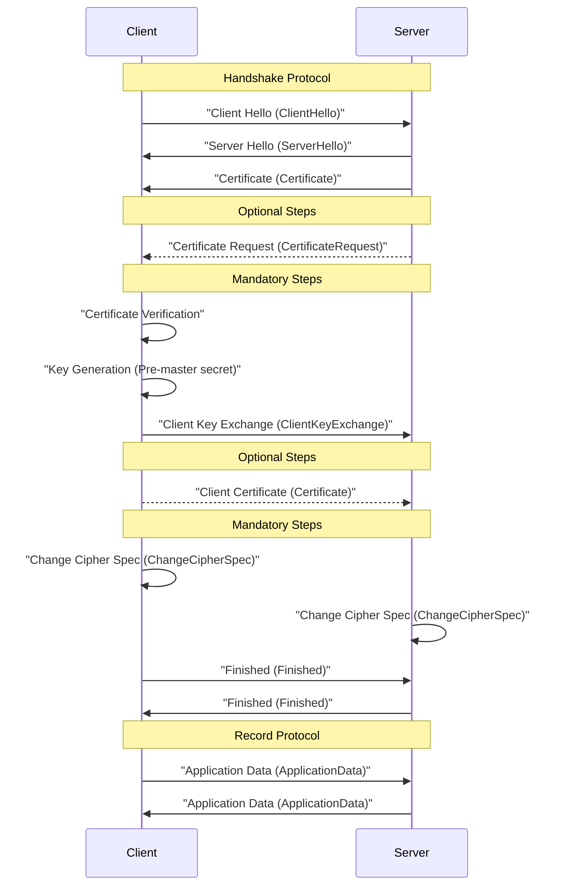

TLS，全称是传输层安全协议（Transport Layer Security），是用于保障互联网通信安全的协议。它的主要任务是确保数据在客户端和服务器之间传输的安全性和完整性。TLS 是 SSL（Secure Sockets Layer）的继承者，SSL 是最早用于此目的的协议，但现在已被TLS取代。

- TLS的工作原理
- **加密**：TLS使用对称加密技术来保护数据的隐私。通过加密，阻止了未经授权的人截获和读取通信内容。
- **完整性**：TLS通过消息认证码(MAC)来验证数据的完整性，确保传输的数据没有被篡改。
- **身份验证**：TLS使用数字证书验证通信双方的身份，防止中间人攻击。
- TLS的握手过程

在TLS握手过程中，各方使用了多种文件和数据结构来确保安全通信。以下是握手过程中可能涉及的主要文件和数据：

- 服务器证书
- 含有服务器的公钥，用于客户端验证服务器身份。
- 服务器私钥
- 服务器端保存，用于解密预主密钥和签名，永不发送。
- 客户端证书（可选）
- 如果需要客户端认证，客户端将提供其证书给服务器。
- 客户端私钥（可选）
- 如果进行客户端认证，客户端需要用其私钥进行签名。
- 证书颁发机构（CA）证书
- 客户端和服务器各有一个，用于分别验证服务器和客户端证书是否可信。
- 会话密钥
- 在握手过程中生成，用于对称加密会话数据。

图 10. TLS握手时序图

实线箭头（->>）表示必须步骤

虚线箭头（-->>）表示可选步骤

- TLS握手具体案例分析
1. 客户端问候（Client Hello）
- 客户端向服务器发送一个“Client Hello”消息，包含支持的TLS版本、加密套件列表、压缩方法，以及一个随机数。
1. 服务器问候（Server Hello）
- 服务器回应一个“Server Hello”消息，选择与客户端使用的TLS版本和加密套件，并生成一个随机数。
1. 服务器发送证书（Server Certificate）
- 服务器将其数字证书发送给客户端。这个证书包含服务器的公钥。
1. 服务器密钥交换（可选，Server Key Exchange）
- 在某些加密套件中，服务器需要发送附加的密钥交换信息。
1. 请求客户端证书（可选，Certificate Request）
- 如果需要客户端认证，服务器会请求客户端提供证书。
1. 服务器问候结束（Server Hello Done）
- 服务器最后发送一个“Server Hello Done”消息，表示它完成了问候阶段。
1. 客户端发送证书（可选，Client Certificate）
- 如果服务器要求，客户端会发送其证书以供验证。
1. 客户端密钥交换（Client Key Exchange）
- 客户端生成一个“Pre-Master Secret”，用服务器的公钥加密，并发送给服务器。
1. 客户端验证（Certificate Verify，若有客户端证书）
- 客户端发送一条“Certificate Verify”消息，使用其私钥进行签名以证明其身份（如果要求客户端证书）。
1. 生成会话密钥
- 客户端和服务器都会根据交换的随机数和“Pre-Master Secret”生成同一会话密钥，用于对称加密后续通信的数据。
1. 客户端结束握手：客户端发送“Change Cipher Spec”消息，然后发送“Finished”消息（包含握手阶段的哈希）。
2. 服务器结束握手：服务器接收并验证客户端的“Finished”消息，再发送自己的“Change Cipher Spec”和“Finished”消息。
3. 安全通信开始：握手成功后，客户端和服务器使用协商好的会话密钥开始加密通信。

> 原文发布于 [CSDN](https://blog.csdn.net/weixin_52400878/article/details/151329133)
