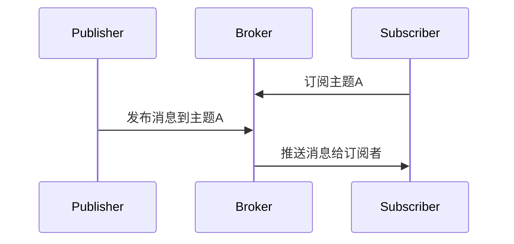
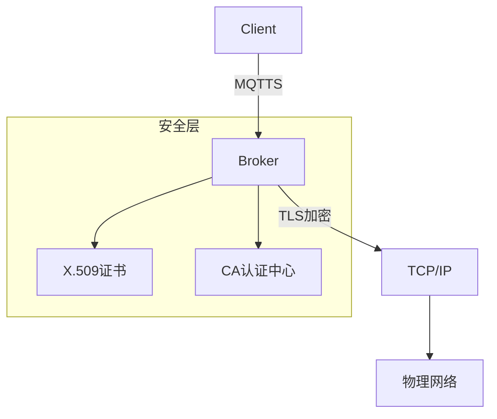
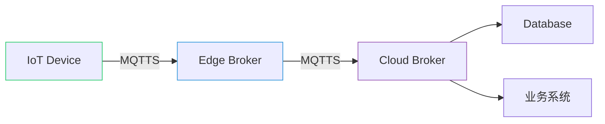

# MQTT协议概述

MQTT（Message Queuing Telemetry Transport）是一种轻量级的发布/订阅消息传输协议，专为低带宽、高延迟或不稳定的网络环境设计。最初由IBM开发，现已成为物联网（IoT）领域中最常用的通信协议之一。MQTT基于TCP/IP协议，支持异步通信，适合设备资源受限的场景。

# MQTT核心特性
- 轻量级和高效：适合物联网（IoT）设备，尤其是资源受限的环境。
- 发布/订阅模式：设备可以发布消息到主题（Topic），也可以订阅主题以接收相关消息。这种模式支持多对多通信。
-	三种服务质量（QoS）：
◦	QoS 0：最多一次传输（不确认）。
◦	QoS 1：至少一次传输（需要确认）。
◦	QoS 2：仅一次传输（确保消息不重复且不丢失）。
-	持久会话：支持客户端断开连接后，保留会话信息，方便重连。
-	遗嘱消息：当客户端意外断开时，服务器可以发布遗嘱消息，通知其他客户端。
- 小型传输头：减少网络流量，提高传输效率。
-	可扩展性：支持大量设备连接，适合大规模物联网应用。

## 总结：
MQTT 的轻量级和低带宽特性，常用于物联网、移动应用、传感器网络和智能家居等领域。
后续小章节会介绍MQTT每个特点。


# MQTT 发布/订阅模式详解

## 1. 基本概念

MQTT（Message Queuing Telemetry Transport）是一种**轻量级**的物联网通信协议，基于**发布/订阅**模型设计，适用于低带宽、高延迟或不稳定的网络环境。
## 2. 核心组件
| 角色        | 功能描述                                                                 |
|-------------|--------------------------------------------------------------------------|
| **Publisher**  | 消息发布者，将消息发送到特定主题（Topic）                                |
| **Subscriber** | 消息订阅者，通过订阅主题接收感兴趣的消息                                |
| **Broker**    | 消息代理服务器，负责消息的路由、存储和转发                               |
| **Topic**     | 消息的分类标识（字符串格式），采用层级结构（如`sensor/temperature/room1`）|

## 3. 工作流程


## 4. 关键特性
### 4.1 主题过滤
- **单级通配符** `+`：匹配单层级（`sensor/+/temp`）
- **多级通配符** `#`：匹配多层级（`sensor/#`）

### 4.2 服务质量（QoS）
| QoS等级 | 描述                          | 消息保证          |
|---------|-----------------------------|-------------------|
| 0       | 最多一次（At most once）     | 无确认，可能丢失  |
| 1       | 至少一次（At least once）    | 确认送达，可能重复|
| 2       | 恰好一次（Exactly once）     | 确保只送达一次    |

### 4.3 保留消息（Retained Message）
- Broker会保存每个主题最后一条保留消息
- 新订阅者立即收到该消息

### 4.4 遗嘱消息（LWT）
- 客户端异常断开时，Broker自动发布预设消息

## 5. 优势
✔ **解耦**：发布者和订阅者无需知道对方存在  
✔ **可扩展**：支持海量设备连接  
✔ **低开销**：最小报文仅2字节  
✔ **实时性**：支持即时消息推送  

## 6. 典型应用场景
- 物联网设备遥测（传感器数据上报）
- 智能家居控制指令推送
- 车联网实时状态更新
- 移动端消息推送服务

## 7. 代码示例（Python）
```python
# 发布者示例
import paho.mqtt.publish as publish
publish.single("sensor/temperature", payload="25.5", hostname="mqtt.broker.com")

# 订阅者示例
import paho.mqtt.subscribe as subscribe
def on_message(client, userdata, message):
    print(f"收到消息: {message.payload.decode()} 主题: {message.topic}")

subscribe.callback(on_message, topics="sensor/#", hostname="mqtt.broker.com")
```

## 8. 安全机制
- TLS/SSL加密通信
- 客户端认证（用户名/密码）
- ACL（访问控制列表）权限管理


# MQTT over TLS (MQTTS) 实现详解

## 1. 基本概念
MQTTS = MQTT + TLS，通过TLS/SSL加密的MQTT协议，默认端口**8883**（未加密MQTT默认1883）

## 2. 层级架构


## 3. 核心组件

### 3.1 证书体系
| 组件              | 作用                                                                 |
|-------------------|----------------------------------------------------------------------|
| **CA证书**         | 根证书，验证整个信任链的合法性                                       |
| **服务器证书**     | Broker端持有的证书，包含公钥和域名信息                               |
| **客户端证书**     | 可选配置，用于双向认证（设备级安全）                                 |

### 3.2 协议栈分层
| 层级       | 协议                | 功能                             |
|------------|---------------------|----------------------------------|
| 应用层     | MQTT                | 业务消息发布/订阅                |
| 安全层     | TLS 1.2/1.3         | 加密/身份验证/完整性校验         |
| 传输层     | TCP                 | 可靠数据传输                     |
| 网络层     | IP                  | 路由寻址                         |


## 4. 安全增强措施

### 4.1 证书验证策略
| 验证类型       | 说明                          | 安全等级 |
|---------------|-------------------------------|---------|
| **单向认证**   | 仅客户端验证服务器证书        | ★★★☆☆   |
| **双向认证**   | 双方互相验证证书              | ★★★★★   |
| **PSK加密**    | 使用预共享密钥替代证书        | ★★☆☆☆   |

### 4.2 推荐配置组合
```yaml
安全组合方案:
  - TLS 1.2+ (禁用SSLv3)
  - ECDHE密钥交换
  - AES256-GCM加密
  - SHA-384哈希算法
  - 双向证书认证
  - OCSP装订（证书状态实时检查）
```

## 5. 性能优化建议

1. **会话恢复**：启用TLS会话票证（Session Tickets）减少握手开销
2. **硬件加速**：使用支持AES-NI的CPU提升加密性能
3. **证书优化**：选择ECC证书（比RSA证书更小更快）
4. **连接池**：保持长连接避免频繁TLS握手

## 6. 调试工具
```bash
# OpenSSL测试连接
openssl s_client -connect broker:8883 -showcerts -tls1_2

# Wireshark过滤条件
tcp.port == 8883 && (ssl || mqtt)
```

## 7. 典型部署架构


> 原文发布于 [CSDN](https://blog.csdn.net/weixin_52400878/article/details/152172157)
