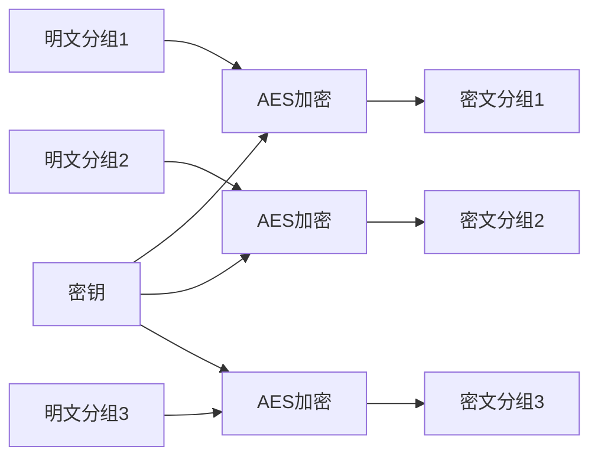
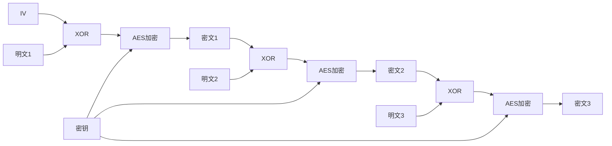
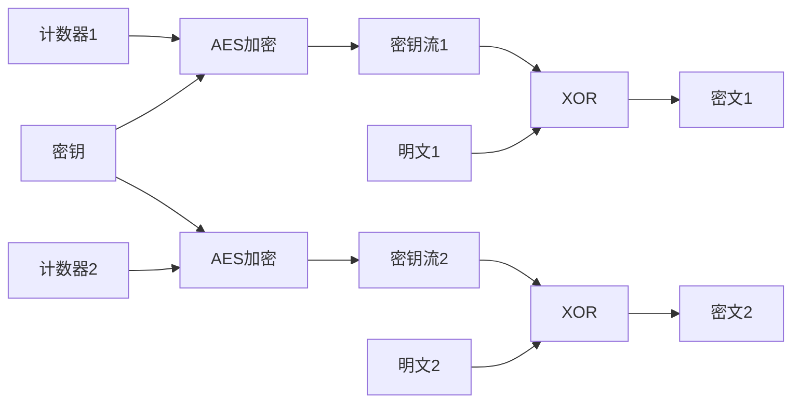
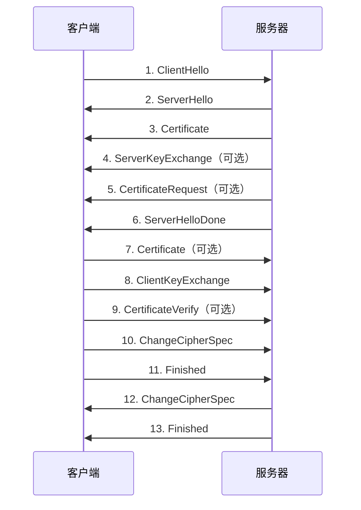

<aside>
✨

</aside>

---

## 引言

在当今的数字化时代，信息安全已经成为嵌入式通信和端侧 AI 领域不可忽视的重要话题。随着物联网设备的普及和边缘计算的发展，越来越多的设备需要在不安全的网络环境中进行通信，这就对数据传输的安全性提出了极高的要求。根据 Gartner 的预测，到 2025 年全球物联网设备数量将超过 750 亿台，其中大部分设备将部署在边缘侧，直接面对各种网络安全威胁。

在这样的背景下，构建安全可靠的通信系统变得至关重要。传统的互联网安全协议往往过于复杂，不适合资源受限的嵌入式设备。我们需要一种既安全又高效的解决方案，能够在计算能力、内存和存储空间都有限的设备上运行，同时提供足够的安全保障。

TLS（Transport Layer Security，传输层安全）协议作为目前应用最广泛的安全通信协议，为我们提供了一套完整的解决方案。它的前身是 SSL（Secure Sockets Layer），由 Netscape 公司在 1994 年首次推出，经过多年的发展和改进，已经成为互联网安全通信的事实标准。TLS 通过结合对称加密和非对称加密的优点，实现了数据的机密性、完整性和身份认证三大安全目标。

在嵌入式领域，由于资源受限（计算能力、内存、存储空间有限），我们需要一个轻量级、高效的 TLS 实现。MbedTLS（前身是 PolarSSL）正是这样一个优秀的选择，它由 ARM 公司维护，专为嵌入式系统设计，具有代码体积小、内存占用低、可裁剪性强等特点。MbedTLS 完全开源，采用 Apache 2.0 许可证，商业使用友好，已经被广泛应用于各种物联网设备、工业控制系统和汽车电子等领域。

在端侧 AI 场景中，安全通信同样重要。随着 AI 模型逐渐向边缘设备迁移，模型保护和数据隐私成为关键问题。TLS 可以保护模型参数的传输，防止模型被窃取。同时也可以保护用户数据的隐私，确保敏感数据不会在传输过程中泄露。MbedTLS 的轻量级特性使得它非常适合在运行 AI 模型的边缘设备上部署，不会给系统带来过多的额外开销。

本文将从基础概念开始，逐步深入介绍 TLS 的核心原理、握手流程，并详细讲解 MbedTLS 库的使用方法。我们将首先探讨对称加密和非对称加密的基本原理，了解它们各自的优缺点和适用场景。然后深入分析 TLS 1.2 和 TLS 1.3 的握手流程，理解 TLS 是如何通过巧妙的协议设计来实现安全通信的。接着介绍 MbedTLS 库的架构、配置和使用方法。最后通过多个实战示例，帮助读者掌握在嵌入式通信和端侧 AI 场景中构建安全通信系统的实际技能。

---

## 对称加密

### 什么是对称加密

对称加密是一种使用相同密钥进行加密和解密的加密方式。发送方和接收方必须共享同一个密钥：发送方用密钥加密数据，接收方用同样的密钥解密数据。

- **优点**：加密/解密速度快，适合大量数据。
- **缺点**：密钥分发困难，在不安全信道上传输密钥本身存在风险。

### 常见的对称加密算法

#### AES（Advanced Encryption Standard）

AES 是目前应用最广泛的对称加密算法，由美国国家标准与技术研究院（NIST）于 2001 年发布，用于替代 DES 算法。

**AES 的特点**

- 分组密码，分组长度为 128 位。
- 支持三种密钥长度：128 位、192 位、256 位。
- 轮数随密钥长度变化：10 轮（128 位）、12 轮（192 位）、14 轮（256 位）。
- 硬件加速支持广泛（如 AES-NI）。

**AES 的常见工作模式**

**ECB（Electronic Codebook，电子密码本模式）**

- **原理**：每个明文分组独立使用相同密钥加密。
- **优点**：简单、快速、支持并行。
- **缺点**：相同明文块产生相同密文块，易被统计分析。
- **结论**：不推荐用于实际应用。



**CBC（Cipher Block Chaining，密码分组链接模式）**

- **原理**：每个明文分组先与前一密文分组异或，再加密。
- **IV**：第一个分组需要随机 IV，不必保密，但必须唯一。
- **优点**：隐藏数据模式。
- **缺点**：加密串行，错误传播。



**CTR（Counter，计数器模式）**

- **原理**：用递增计数器输入分组加密，输出作为密钥流与明文异或。
- **优点**：可并行、可随机访问、不需要填充、错误不传播。
- **注意**：必须确保计数器（Nonce）不重复。



**AEAD（认证加密）模式**

- **GCM**：CTR 加密 + Galois 认证，性能高，TLS 1.2/1.3 首选。
- **CCM**：CTR + CBC-MAC，适合资源受限设备。
- **ChaCha20-Poly1305**：软件性能好，TLS 1.3 常用。

#### ChaCha20

ChaCha20 是 Daniel J. Bernstein 设计的流密码，常作为无硬件加速场景下 AES 的替代方案。

- 流密码，不是分组密码。
- 密钥长度 256 位。
- 软件实现速度快。
- 常用于 TLS 1.3 和 QUIC。

#### 其他对称加密算法

- **3DES**：已不推荐。
- **SM4**：国密分组密码算法。

### 对称加密性能对比

| **算法** | **密钥长度** | **分组长度** | **相对速度** | **硬件加速** |
| --- | --- | --- | --- | --- |
| AES-128 | 128 位 | 128 位 | 快 | 是 |
| AES-256 | 256 位 | 128 位 | 较快 | 是 |
| ChaCha20 | 256 位 | 流密码 | 快（软件） | 否 |
| 3DES | 168 位 | 64 位 | 慢 | 否 |

### 对称加密最佳实践

1. **密钥管理**：安全生成与存储，按策略轮换。
2. **IV/Nonce 唯一性**：CBC/CTR 等模式尤其重要。
3. **优先 AEAD**：不要只加密，还要做完整性认证（GCM 等）。
4. **密钥派生**：从密码派生密钥时，使用 PBKDF2、Argon2 等。

---

## 非对称加密

### 什么是非对称加密

非对称加密（公钥加密）使用一对密钥：公钥与私钥。公钥可以公开分发，私钥必须保密。

- **优点**：密钥分发简单。
- **缺点**：运算开销大，不适合加密大量数据。

### 非对称加密的核心用途

1. **密钥交换**：在不安全信道上协商共享密钥。
2. **数字签名**：验证来源与完整性。
3. **加密小数据**：例如对称密钥、随机数等。

### 常见的非对称加密算法

#### RSA

RSA 是 1977 年提出的经典算法，广泛用于证书签名与兼容性要求强的场景。

**RSA 核心步骤（概念层面）**

- 选择大素数 p、q，计算 n = p × q。
- 计算 φ(n) = (p−1) × (q−1)。
- 选择公钥指数 e。
- 计算私钥指数 d，使 d×e ≡ 1（mod φ(n)）。

**安全性建议**

- 推荐 RSA-2048（短期），长期可考虑更高位数或迁移到 ECC。

---

## TLS 握手流程详解

### TLS 概述

TLS 位于应用层与传输层之间，为通信提供：

1. **机密性**
2. **完整性**
3. **身份认证**

### TLS 1.2 握手流程（概要）



### TLS 1.3 改进点（概览）

- 握手从 2-RTT 降为 1-RTT。
- 移除一批不安全或不必要的算法与流程。
- 强制前向安全。
- ServerHello 之后握手消息加密。
- 在特定条件下支持 0-RTT 数据（需注意重放风险）。

---

## MbedTLS 库介绍

### 什么是 MbedTLS

MbedTLS 是轻量级的密码学与 SSL/TLS 库，面向嵌入式系统，特点是：

- **体积小、内存占用低**
- **可裁剪**（通过 config.h 宏开关）
- **跨平台**（RTOS 与裸机）
- **模块化**（加密原语、证书、TLS 层清晰）

### 典型架构

```
┌──────────────────────────────┐
│  SSL/TLS 协议层              │
├──────────────────────────────┤
│  X.509 证书层                 │
├──────────────────────────────┤
│  密码学原语层                 │
├──────────────────────────────┤
│  平台抽象层（内存/随机数/IO） │
└──────────────────────────────┘
```

---

## 常见问题排查与最佳实践

### 握手失败排查（示例）

```c
int ret = mbedtls_ssl_handshake(&ssl);
if (ret != 0) {
	char error_buf[200];
	mbedtls_strerror(ret, error_buf, sizeof(error_buf));
	printf("握手失败: -0x%04X - %s\n", (unsigned int)(-ret), error_buf);
}
```

### 证书验证失败排查（示例）

```c
uint32_t flags = mbedtls_ssl_get_verify_result(&ssl);
if (flags != 0) {
	char vrfy_buf[512];
	mbedtls_x509_crt_verify_info(vrfy_buf, sizeof(vrfy_buf), "  ! ", flags);
	printf("证书验证失败:\n%s\n", vrfy_buf);
}
```

> 原文发布于 [CSDN](https://blog.csdn.net/weixin_52400878/article/details/159158794)
